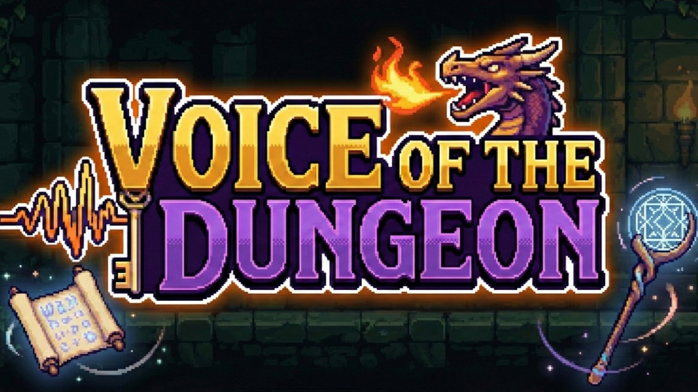
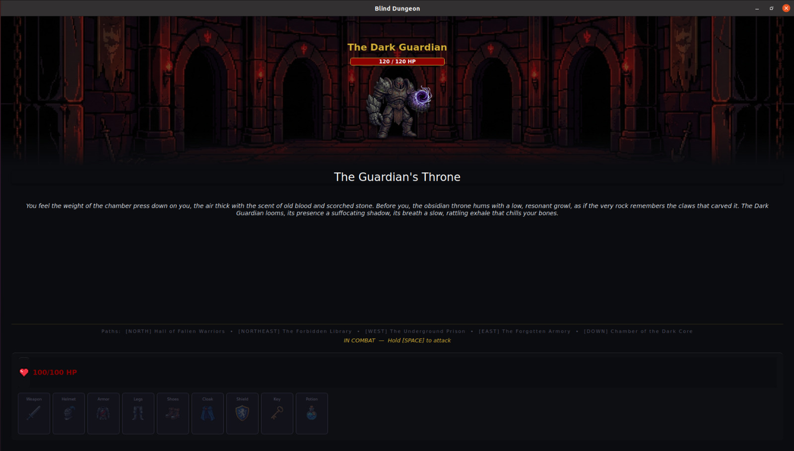

# Voice of the Dungeon

<p align="center">
  
</p>

An AI-powered voice-driven RPG where Mistral acts as your Game Master and your voice shapes the adventure.

Built for the [Mistral Worldwide Hackathon](https://luma.com/mistralhack-online) (Feb 28 – Mar 1, 2026).

Demo : https://www.youtube.com/watch?v=zVtanHrKbbU
---

## Overview

Voice of the Dungeon is a Dungeons & Dragons-inspired RPG where **the AI is your Game Master**. There's no controller, no menu to click through — you speak, and the world responds. The AI narrates your surroundings, reacts to your decisions, and drives the story forward in real time.

Hold Space, say what you want to do, and the Game Master takes it from there — whether that's moving deeper into the dungeon, deciding how to handle an enemy encounter, picking up a mysterious item, or choosing to run. Every decision is yours to make, voiced naturally, and answered with atmospheric narration powered by Mistral and spoken aloud by ElevenLabs.

The core loop:
1. Hold **Space** and speak your intention (e.g. *"I want to head north"*, *"let me grab that sword"*, *"I'll attack with the axe"*)
2. Mistral understands your intent and generates a Game Master response
3. ElevenLabs voices the narration aloud
4. Make decisions, explore rooms, fight monsters, and find your way out

---

## Features

- **Voice-controlled gameplay** — hold-to-talk mechanic with real-time transcription via ElevenLabs Scribe v2
- **AI narration** — every room entry, item pickup, and combat exchange is narrated by Mistral LLM in a dark fantasy tone
- **Structured intent parsing** — Mistral extracts actions (move, attack, pickup) from freeform speech using structured output
- **Combat system** — boss room with HP tracking, weapon-based attacks, and skill-based enemy counterattacks
- **Item & inventory system** — pick up weapons, armor, potions, and keys; equip gear across 7 equipment slots
- **Roaming monsters** — enemies move between rooms autonomously and can ambush you mid-exploration
- **Atmospheric audio** — background music per room type (home, normal, boss, exit) with combat sound stingers
- **Persistent state** — game saves to JSON and resumes where you left off

---

## Screenshot

<p align="center">
  
</p>

---

## Tech Stack

| Layer | Technology |
|---|---|
| Language | Python 3.11+ |
| UI | PyQt6 (portrait mobile-style layout) |
| LLM (narration) | Mistral — `mistral-large-latest` |
| LLM (intent parsing) | Mistral — `ministral-8b-latest` with structured output |
| Text-to-speech | ElevenLabs — `eleven_multilingual_v2` |
| Speech-to-text | ElevenLabs Scribe v2 Realtime (WebSocket) |
| Audio playback | pygame |
| Microphone capture | pyaudio |
| Data validation | Pydantic |

---

## How We Use Mistral and ElevenLabs

### Mistral

**Narration (mistral-large-latest)**
Every game event — entering a room, picking up an item, winning a fight, dying — triggers a call to Mistral. The model generates a 1–2 sentence atmospheric narration given the current game context (room name, exits, items, combat stats). All prompts are engineered to keep the tone dark, concise, and immersive.

**Intent Parsing (ministral-8b-latest)**
When a player speaks a command, the transcript goes through `IntentParser`, which calls Mistral with a Pydantic response schema. The model returns a structured JSON object — `{ action: "move", direction: "north" }` or `{ action: "attack", weapon: "iron sword" }` — making player input deterministic and low-latency.

```
Player says: "I want to go north"
  → IntentParser.parse() → Mistral structured output
  → IntentAction(action="move", direction="north")
  → GameController handles move, triggers narration
```

### ElevenLabs

**Text-to-Speech**
All narration text generated by Mistral is piped to ElevenLabs TTS (`eleven_multilingual_v2`, George voice). The audio is saved as MP3 and played via pygame, making the narration fully voiced with a consistent dungeon-master persona.

**Real-time Speech-to-Text (Scribe v2)**
When the player holds Space, a WebSocket connection opens to ElevenLabs Scribe v2. Audio chunks (PCM 16-bit mono, 16kHz) stream in real time, with partial transcripts shown live in the UI. The final transcript is emitted when Space is released, feeding into intent parsing.

```
Hold Space → mic stream → ElevenLabs WebSocket → partial transcripts (live)
Release Space → final transcript → IntentParser → game action
```

---

## Quick Start

**Prerequisites**: Python 3.11+, a working microphone

### 1. Clone and set up environment

```bash
git clone <repo-url>
cd voice-of-the-dungeon

python -m venv env
source env/bin/activate       # Windows: env\Scripts\activate
```

### 2. Install dependencies

```bash
pip install -r requirements.txt
```

### 3. Configure API keys

```bash
cp .env.example .env
```

Edit `.env` and fill in your keys:

```env
MISTRAL_API_KEY=your_mistral_key
ELEVENLABS_API_KEY=your_elevenlabs_key
```

### 4. Run the game

```bash
python main.py
```

Hold **Space** to speak. Release to send your command.

---

## Project Structure

```
mistral-hackathon/
├── main.py                  # Entry point
├── config.py                # Models, audio settings, UI config
├── requirements.txt
│
├── ai/
│   ├── mistral_client.py    # Mistral SDK wrapper (chat + structured output)
│   ├── narrator.py          # Chains Mistral LLM → ElevenLabs TTS
│   ├── intent_parser.py     # Parses voice commands into structured actions
│   ├── tts_client.py        # TTS abstraction (ElevenLabs default)
│   ├── stt_client.py        # STT abstraction (ElevenLabs Scribe v2 active)
│   └── prompts.py           # All LLM prompt templates
│
├── game/
│   ├── game_controller.py   # Central orchestrator (state, AI, workers, signals)
│   ├── game_state.py        # Player/world state, JSON persistence
│   ├── dungeon_map.py       # Room graph and exit validation
│   ├── combat.py            # Combat resolver
│   └── monster_ai.py        # Roaming monster movement logic
│
├── ui/
│   ├── main_window.py       # Root QMainWindow
│   ├── game_view.py         # Room image, narration text, inventory UI
│   └── signals.py           # Central Qt signal bus
│
├── audio/
│   ├── audio_manager.py     # pygame.mixer wrapper
│   └── bg/                  # Background music per room type
│
├── data/
│   ├── items.json           # Weapons, armor, potions
│   ├── bosses.json          # Boss definitions
│   └── monsters.json        # Roaming monster definitions
│
├── maps/
│   └── dungeon_map.json     # Room layout, exits, boss placement
│
└── assets/                  # Images, icons, monster art
```

---

## Controls

| Input | Action |
|---|---|
| Hold **Space** | Record voice command |
| Release **Space** | Send command |

### Voice Commands

| Say | Effect |
|---|---|
| *"go north / south / east / west"* | Move between rooms |
| *"pick up the sword"* | Pick up an item |
| *"attack with the axe"* | Attack in combat |
| *"drink the potion"* | Consume a health potion |

---

## Credits

| Asset | Tool |
|---|---|
| Game icons & background images | [Google Gemini](https://gemini.google.com) (image generation) |
| Background music | [Suno](https://suno.com) (AI music generation) |
